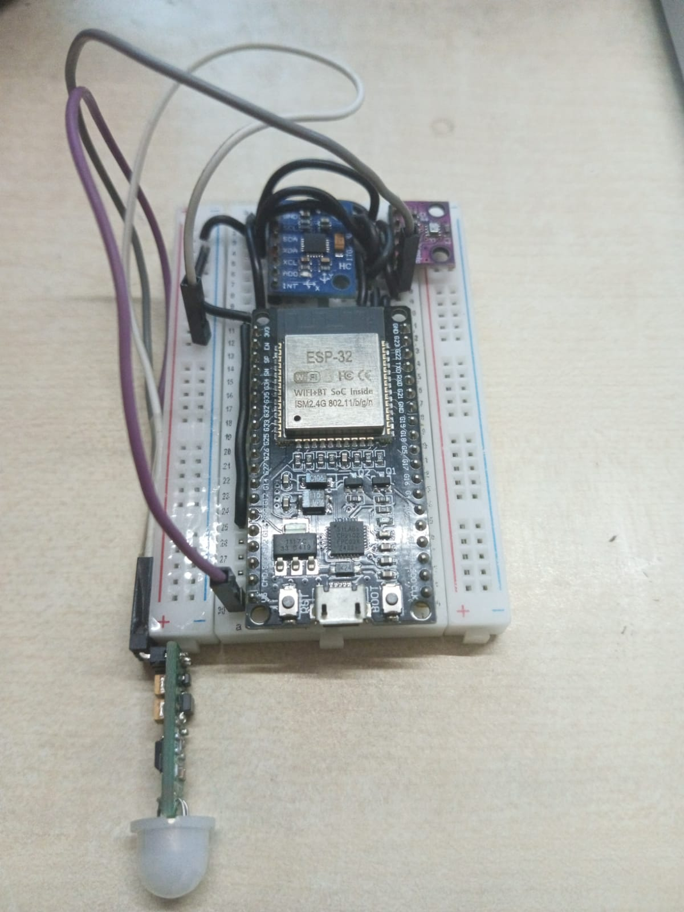

# V.I.C.T.O.R.

**Vanguard Infrastructure Command & Threat Observation Relay**

## Introduction

V.I.C.T.O.R. is an autonomous, edge-to-cloud disaster management and critical infrastructure monitoring system. It is designed to be deployed in emergency shelters, generator rooms, and critical government infrastructure during catastrophic events such as cyclones or earthquakes. 

Instead of relying on manual human inspection, the system acts as a digital sentinel. It monitors structural integrity, severe weather fronts, and human life-signs in real-time, providing centralized command centers with immediate, zero-latency situational awareness without requiring personnel to enter hazardous zones.

## System Architecture

The project utilizes a decoupled, three-tier architecture:

1. **Edge Compute Layer (Hardware):** An ESP32 microcontroller interfaces with environmental and kinematic sensors. It performs local threat assessment (edge computing) to calculate structural stress and weather anomalies before transmitting standard JSON payloads via HTTP POST.
2. **Backend API Layer (Node.js):** A lightweight Express.js REST API hosted on Render. It acts as an in-memory data broker, receiving telemetry from the edge node and serving it to the client dashboard, alongside managing remote execution queues (e.g., remote reboot commands).
3. **Presentation Layer (Frontend):** A custom HTML5/CSS/JavaScript dashboard utilizing Chart.js for real-time telemetry visualization. It features an automated Situation Report (SITREP) generator and an active threat assessment board.

## Hardware Configuration

The edge node utilizes a standard ESP32 development board connected to three primary sensors. 

### Bill of Materials
* ESP32 Microcontroller
* MPU6050 (6-Axis Accelerometer and Gyroscope)
* BMP280 (Barometric Pressure and Ambient Temperature)
* HC-SR501 (Passive Infrared / Life-Sign Sensor)

### Wiring Diagram and Pin Mapping

**1. MPU6050 (I2C Address: 0x68)**
* VCC -> ESP32 3.3V
* GND -> ESP32 GND
* SDA -> ESP32 GPIO 21
* SCL -> ESP32 GPIO 22

**2. BMP280 (I2C Address: 0x76)**
* VCC -> ESP32 3.3V
* GND -> ESP32 GND
* SDA -> ESP32 GPIO 21
* SCL -> ESP32 GPIO 22
* SDO -> ESP32 GND (Required to force address 0x76 and avoid conflicts)

**3. HC-SR501 PIR (Digital Input)**
* VCC -> ESP32 VIN (5V required for reliable operation)
* GND -> ESP32 GND
* OUT -> ESP32 GPIO 4

## Software Stack

* **Firmware:** C++ (Arduino Core), utilizing `HTTPClient` for network transmission and `ArduinoJson` for payload serialization.
* **Backend:** Node.js, Express, CORS.
* **Frontend:** HTML5, CSS3 (CSS Variables for enterprise styling), Vanilla JavaScript, Chart.js.

## Real-World Use Cases

1. **Structural Triage:** The MPU6050 continuously monitors building sway and micro-fractures. If an earthquake or extreme wind sheer exceeds nominal parameters, the system triggers a structural anomaly alert prior to critical failure.
2. **Hyper-Local Weather Tracking:** The BMP280 monitors barometric pressure. A sudden, violent drop in atmospheric pressure (below 1000 hPa) serves as a predictive indicator of a severe cyclonic storm front directly overhead.
3. **Trapped Survivor Detection:** The PIR sensor operates as a passive life-sign scanner. In the event of a structural collapse, central command can identify human thermal movement inside the rubble without risking blind rescue operations.

## Deployment Guide

Follow these steps to deploy the system from scratch.

### 1. Deploy the Backend
1. Create a GitHub repository and push the contents of the `Backend/` directory.
2. Log into Render.com and create a new "Web Service".
3. Connect your GitHub repository. Render will automatically detect the Node.js environment via the `package.json` file.
4. Click Deploy. Note the provided `.onrender.com` URL.

### 2. Configure the Edge Node
1. Open `ESP32/ESP32_Render.ino` in the Arduino IDE.
2. Modify the `ssid` and `password` variables to match your local WiFi network.
3. Update the `SERVER_URL_TELEMETRY` and `SERVER_URL_COMMAND` constants to point to your new Render URL.
4. Compile and flash the code to your ESP32.

### 3. Launch the Dashboard
1. Open `Frontend/index.html` in a code editor.
2. Update the `BASE_URL` constant on line 360 to match your Render URL.
3. Open `index.html` in any modern web browser. The system will immediately begin polling the backend and visualizing the incoming telemetry.

